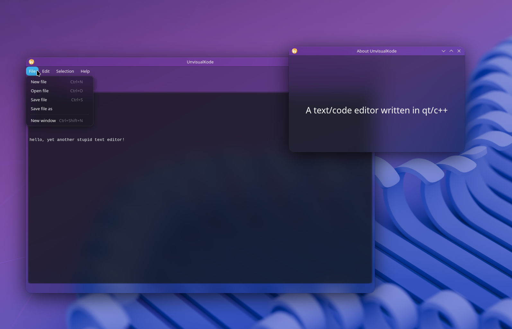

# Yet another useless someone's pet project

### It should be like text/code editor built on qt/c++ and inspired by vs code, it is a bit vibecoded with some understanding of things, so yeah, useless

### Why qt? Well, it looks cool with raised kde plasma (which i use), and it's crossplatform, so no more platform specific code!
